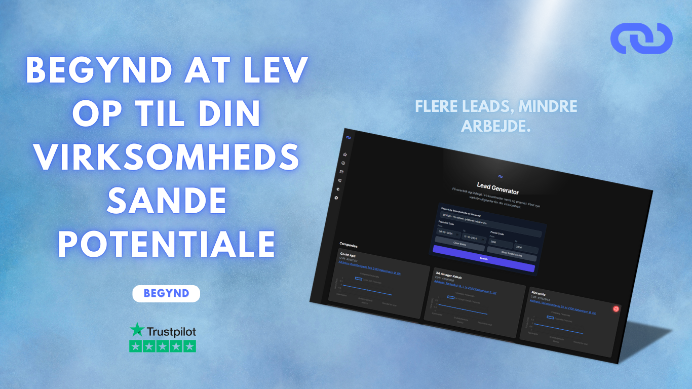

# 🚀 Targo Lead Generator

**Automated AI-Powered Lead Generation for Danish Businesses**

---

## 🔍 What is Targo?

Targo is a smart lead generation tool designed to help sales teams, marketers, and B2B service providers discover and qualify **newly registered companies in Denmark** — fast and effortlessly.

By combining official CVR company data with cutting-edge AI, Targo provides rich insights that help you target the right leads at exactly the right time.

---

## 🎥 Demo

[](https://streamable.com/07otx5)

*Click the image above to watch the real showcase video.*

---

## ✨ Key Features

- 🏢 **Real-time discovery:** Automatically fetches new company registrations from Denmark’s official CVR API  
- 🤖 **AI-powered analysis:** Uses OpenAI GPT to evaluate company profiles and generate meaningful insights  
- 📊 **Lead scoring & categorization:** Prioritizes leads by industry, location, and business activity  
- 📥 **Easy exports:** Download lead lists in CSV format or integrate with your CRM workflow  
- 🎨 **Modern UI:** Responsive and clean frontend built with Tailwind CSS and HTML  

---

## 🎯 Who Should Use Targo?

- Digital marketing agencies looking for fresh B2B prospects  
- Accounting and consulting firms targeting new startups  
- SaaS companies hunting for early adopters  
- Sales teams aiming to automate lead sourcing and qualification  

---

## 🚀 Getting Started

1. **Clone the repository**  
   ```bash
   git clone https://github.com/rlyngby/Targo-Leadgenerator.git
   cd Targo-Leadgenerator
